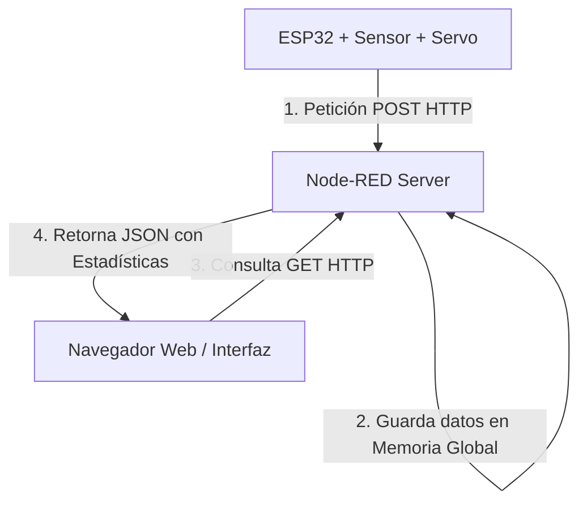

# Guía de Integración: Dashboard de Control de Acceso Vehicular con Node-RED

Esta guía explica cómo configurar y conectar la interfaz gráfica diseñada en [dashboard.html](file:///home/ivan/Proyectos/control-acceso-vehicular/dashboard.html) con tu servidor de **Node-RED** y tu **ESP32**.

---

## 1. ¿Cómo funciona la arquitectura?



---

## 2. Configuración en Node-RED (Importar Flujo)

Para facilitarte la vida, aquí tienes el código JSON para importar directamente a Node-RED. Este flujo configura:
1. Un endpoint `GET /dashboard` para servir la interfaz web.
2. Un endpoint `GET /api/datos` para entregar el JSON con las estadísticas y registros históricos en memoria global.
3. Un endpoint `POST /api/evento` donde tu ESP32 reportará las detecciones.

### Pasos para Importar:
1. Abre tu panel de Node-RED en el navegador.
2. Ve al menú superior derecho (tres líneas horizontales) -> **Import**.
3. Copia y pega el siguiente bloque JSON y haz clic en **Import**.

```json
[
    {
        "id": "flow_control_acceso",
        "type": "tab",
        "label": "Control de Acceso Vehicular",
        "disabled": false,
        "info": ""
    },
    {
        "id": "http_dashboard_in",
        "type": "http in",
        "z": "flow_control_acceso",
        "name": "GET /dashboard",
        "url": "/dashboard",
        "method": "get",
        "upload": false,
        "swaggerDoc": "",
        "x": 120,
        "y": 120,
        "wires": [
            [
                "read_dashboard_file"
            ]
        ]
    },
    {
        "id": "read_dashboard_file",
        "type": "file in",
        "z": "flow_control_acceso",
        "name": "Leer dashboard.html",
        "filename": "/home/ivan/Proyectos/control-acceso-vehicular/dashboard.html",
        "format": "utf8",
        "chunk": false,
        "sendError": false,
        "encoding": "none",
        "allProps": false,
        "x": 340,
        "y": 120,
        "wires": [
            [
                "http_dashboard_res"
            ]
        ]
    },
    {
        "id": "http_dashboard_res",
        "type": "http response",
        "z": "flow_control_acceso",
        "name": "Responder HTML",
        "statusCode": "",
        "headers": {},
        "x": 570,
        "y": 120,
        "wires": []
    },
    {
        "id": "http_api_datos_in",
        "type": "http in",
        "z": "flow_control_acceso",
        "name": "GET /api/datos",
        "url": "/api/datos",
        "method": "get",
        "upload": false,
        "swaggerDoc": "",
        "x": 120,
        "y": 220,
        "wires": [
            [
                "get_stats_memory"
            ]
        ]
    },
    {
        "id": "get_stats_memory",
        "type": "function",
        "z": "flow_control_acceso",
        "name": "Obtener Stats de Memoria",
        "func": "let stats = global.get(\"vehiculo_stats\") || {\n    todayCount: 0,\n    totalCount: 0,\n    gateState: \"CERRADA\",\n    lastDistance: 150,\n    hourlyTraffic: Array(12).fill(0),\n    logs: []\n};\n\nmsg.payload = stats;\nreturn msg;",
        "outputs": 1,
        "noerr": 0,
        "initialize": "",
        "finalize": "",
        "libs": [],
        "x": 350,
        "y": 220,
        "wires": [
            [
                "http_api_datos_res"
            ]
        ]
    },
    {
        "id": "http_api_datos_res",
        "type": "http response",
        "z": "flow_control_acceso",
        "name": "Responder JSON",
        "statusCode": "",
        "headers": {
            "Access-Control-Allow-Origin": "*"
        },
        "x": 570,
        "y": 220,
        "wires": []
    },
    {
        "id": "http_api_post_evento",
        "type": "http in",
        "z": "flow_control_acceso",
        "name": "POST /api/evento",
        "url": "/api/evento",
        "method": "post",
        "upload": false,
        "swaggerDoc": "",
        "x": 130,
        "y": 320,
        "wires": [
            [
                "process_esp32_event"
            ]
        ]
    },
    {
        "id": "process_esp32_event",
        "type": "function",
        "z": "flow_control_acceso",
        "name": "Procesar Evento ESP32",
        "func": "let stats = global.get(\"vehiculo_stats\") || {\n    todayCount: 0,\n    totalCount: 0,\n    gateState: \"CERRADA\",\n    lastDistance: 150,\n    hourlyTraffic: Array(12).fill(0),\n    logs: []\n};\n\nlet payload = msg.payload;\nlet distancia = parseInt(payload.distancia) || 150;\nlet estado = payload.estado_barrera || \"CERRADA\"; // \"ABIERTA\" o \"CERRADA\"\nlet evento = payload.evento || \"lectura\"; // \"deteccion\" o \"cierre\"\n\nstats.lastDistance = distancia;\nstats.gateState = estado;\n\nlet now = new Date();\n// Formato de hora local para los logs\nlet timeStr = now.toLocaleDateString() + \" \" + now.toLocaleTimeString();\n\nif (evento === \"deteccion\") {\n    stats.todayCount += 1;\n    stats.totalCount += 1;\n    \n    // Sumar 1 a la hora actual en el gráfico (última posición del array)\n    stats.hourlyTraffic[11] += 1;\n    \n    stats.logs.push({\n        time: timeStr,\n        event: \"Vehículo Detectado\",\n        distance: distancia + \" cm\",\n        state: \"ABIERTA\"\n    });\n} else if (evento === \"cierre\") {\n    stats.logs.push({\n        time: timeStr,\n        event: \"Barrera Cerrada\",\n        distance: distancia + \" cm\",\n        state: \"CERRADA\"\n    });\n}\n\n// Mantener solo los últimos 50 logs en memoria para no saturar\nif (stats.logs.length > 50) {\n    stats.logs.shift();\n}\n\nglobal.set(\"vehiculo_stats\", stats);\n\nmsg.payload = { status: \"success\", message: \"Datos actualizados\" };\nreturn msg;",
        "outputs": 1,
        "noerr": 0,
        "initialize": "",
        "finalize": "",
        "libs": [],
        "x": 370,
        "y": 320,
        "wires": [
            [
                "http_post_res"
            ]
        ]
    },
    {
        "id": "http_post_res",
        "type": "http response",
        "z": "flow_control_acceso",
        "name": "OK 200",
        "statusCode": "200",
        "headers": {},
        "x": 560,
        "y": 320,
        "wires": []
    }
]
```

---

## 3. ¿Cómo debe mandar los datos el ESP32?

Tu ESP32 debe conectarse a tu red Wi-Fi y enviar una petición HTTP POST cada vez que el sensor detecte un carro (abrir la barrera) y otra cuando el carro termine de pasar (cerrar la barrera).

### Ejemplo de código C++ para el ESP32:

```cpp
#include <WiFi.h>
#include <HTTPClient.h>

const char* ssid = "TU_WIFI_SSID";
const char* password = "TU_WIFI_PASSWORD";

// Dirección IP del servidor donde corre Node-RED (puerto 1880 por defecto)
const char* serverUrl = "http://192.168.1.XX:1880/api/evento"; 

void enviarEventoNodeRed(String evento, int distancia, String estadoBarrera) {
    if (WiFi.status() == WL_CONNECTED) {
        HTTPClient http;
        http.begin(serverUrl);
        http.addHeader("Content-Type", "application/json");
        
        // Crear el JSON
        String jsonPayload = "{\"evento\":\"" + evento + "\",\"distancia\":" + String(distancia) + ",\"estado_barrera\":\"" + estadoBarrera + "\"}";
        
        int httpResponseCode = http.POST(jsonPayload);
        
        if (httpResponseCode > 0) {
            Serial.print("Código de respuesta del servidor: ");
            Serial.println(httpResponseCode);
        } else {
            Serial.print("Error enviando POST: ");
            Serial.println(httpResponseCode);
        }
        http.end();
    }
}

// Ejemplo de uso al detectar un auto:
// enviarEventoNodeRed("deteccion", 15, "ABIERTA");

// Ejemplo de uso al cerrar la barrera:
// enviarEventoNodeRed("cierre", 180, "CERRADA");
```

---

## 4. Visualizar y probar el Dashboard

1. **Localmente en tu navegador:** 
   Puedes abrir directamente el archivo [dashboard.html](file:///home/ivan/Proyectos/control-acceso-vehicular/dashboard.html) dando doble clic.
2. **Modo Simulador:** 
   Por defecto, la interfaz iniciará en **Modo Simulador Activo**. Verás carros pasar de forma ficticia cada pocos segundos, el semáforo cambiar a verde, la barra levantarse en 90° con animación suave y las gráficas y registros actualizarse. ¡Esto es excelente para comprobar el funcionamiento visual de inmediato!
3. **Conexión Real con Node-RED:**
   - Despliega el flujo importado en Node-RED.
   - En la parte superior de la interfaz, introduce la URL del endpoint: `http://TU_IP_SERVER:1880/api/datos`.
   - Haz clic en **Conectar API** (se desactivará el simulador y comenzará a leer los datos reales de Node-RED cada 3 segundos).
