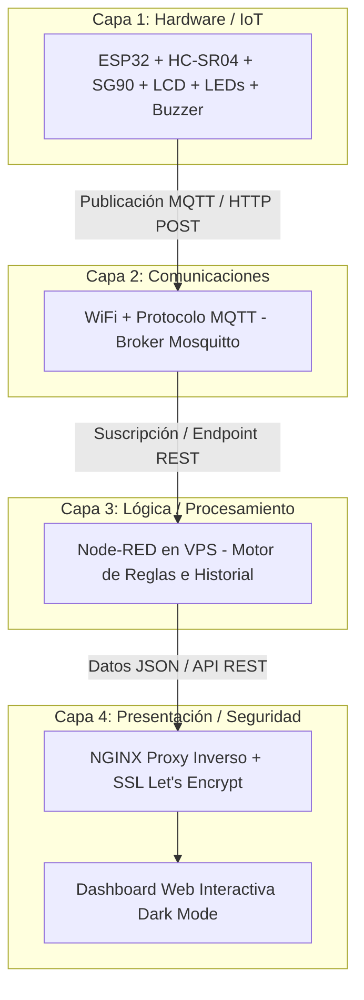

# Sistema Inteligente de Control de Acceso Vehicular IoT

Este repositorio contiene la implementación completa del proyecto final de **Tecnologías Emergentes** (5to Ciclo - Diseño y Desarrollo de Software, TECSUP). Consiste en una plataforma de IoT integrada para la automatización, señalización y monitoreo remoto de barreras de estacionamiento o áreas restringidas en tiempo real.

---

## 📋 Contenidos
1. [Descripción del Proyecto y Lógica de Control](#-descripción-del-proyecto-y-lógica-de-control)
   - [Ciclos de Semáforo y Barrera Automática](#ciclos-de-semáforo-y-barrera-automática)
   - [Lógica de Cooldown Dinámico (Rojo)](#lógica-de-cooldown-dinámico-rojo)
   - [Decaimiento del Contador de Tráfico](#decaimiento-del-contador-de-tráfico)
   - [Override Manual (Comandos Remotos)](#override-manual-comandos-remotos)
2. [Arquitectura del Sistema (Capas)](#-arquitectura-del-sistema-capas)
3. [Especificaciones de Hardware](#-especificaciones-de-hardware)
   - [Componentes Utilizados](#componentes-utilizados)
   - [Mapeo de Pines (ESP32)](#mapeo-de-pines-esp32)
4. [Especificaciones de Software](#-especificaciones-de-software)
5. [Configuración del Broker MQTT](#-configuración-del-broker-mqtt)
   - [Parámetros de Conexión y Red](#parámetros-de-conexión-y-red)
   - [Topología de Tópicos](#topología-de-tópicos)
   - [Mensajes de Ejemplo](#mensajes-de-ejemplo)
6. [Calibración del Sensor de Distancia](#-calibración-del-sensor-de-distancia)
7. [Instrucciones de Instalación y Despliegue](#-instrucciones-de-instalación-y-despliegue)
   - [1. Configuración del Firmware](#1-configuración-del-firmware)
   - [2. Configuración en Node-RED](#2-configuración-en-node-red)
   - [3. Despliegue del Dashboard Web](#3-despliegue-del-dashboard-web)
   - [4. Despliegue en VPS (Nginx + SSL)](#4-despliegue-en-vps-nginx--ssl)
8. [Integrantes y Créditos](#-integrantes-y-créditos)

---

## 🚗 Descripción del Proyecto y Lógica de Control

El proyecto automatiza la barrera física de un estacionamiento combinando la detección por ultrasonido con una lógica de semáforo inteligente adaptativa y control manual centralizado desde la web.

### Ciclos de Semáforo y Barrera Automática
El sistema en modo automático ejecuta un ciclo cerrado no bloqueante:
1. **Luz Verde (Paso Libre):** La barrera física se mantiene abierta verticalmente (servomotor a 90°), el semáforo enciende el LED verde y la pantalla LCD muestra `"LUZ: VERDE | PASO LIBRE"`. Este estado tiene una duración de 5 segundos.
2. **Luz Amarilla (Cerrando Transición):** La barrera desciende de 90° a 0° de forma suave (decrementos de 2° cada 40ms, completando la transición en 1.8s) mientras parpadea el LED amarillo. La pantalla LCD muestra `"LUZ: AMARILLO | BAJANDO BARRERA"`.
3. **Luz Roja (Alto / Cooldown):** La barrera permanece totalmente cerrada (servo a 0°), el LED rojo se enciende y la pantalla LCD muestra `"LUZ: ROJO | ALTO - NO PASAR"`. La duración de la luz roja (cooldown) se calcula de forma dinámica en base al volumen de autos detectados durante el ciclo anterior.
4. **Luz Amarilla (Abriendo Transición):** Al finalizar el tiempo de cooldown de la luz roja, el servo se eleva de 0° a 90° de manera suave con parpadeo del LED amarillo, indicando `"LUZ: AMARILLO | SUBIENDO BARRERA"`, para iniciar nuevamente el ciclo en Luz Verde.

### Lógica de Cooldown Dinámico (Rojo)
Durante el ciclo, si el sensor ultrasónico detecta un vehículo a una distancia $\le 15$ cm (con filtro anti-rebote), el contador se incrementa y suena el buzzer local. Al llegar al estado de Luz Roja, la duración de este periodo se adapta dinámicamente usando la función `calcularCooldown(contadorAutos)`:
* **0 autos detectados:** Cooldown de **5 segundos**.
* **1 a 3 autos detectados:** Cooldown de **10 segundos**.
* **4 a 5 autos detectados:** Cooldown de **20 segundos**.
* **6 a 10 autos detectados:** Cooldown de **30 segundos**.
* **Más de 10 autos detectados:** Cooldown rápido de **2 segundos** de emergencia.

### Decaimiento del Contador de Tráfico
Para simular el flujo dinámico real, si transcurren más de 5 segundos sin que el sensor detecte automóviles, el valor de `contadorAutos` decrece automáticamente en 1 unidad de manera periódica, liberando paulatinamente el nivel de ocupación.

### Override Manual (Comandos Remotos)
El operador web puede forzar el comportamiento físico en cualquier momento mediante MQTT:
* **Comando `ABRIR`:** Levanta de inmediato la barrera (servo a 90°), enciende la luz verde del semáforo y detiene el ciclo automático. Pantalla LCD: `"CONTROL MANUAL | BARRERA: ABIERTA"`.
* **Comando `CERRAR`:** Baja de inmediato la barrera (servo a 0°), enciende la luz roja del semáforo y detiene el ciclo automático. Pantalla LCD: `"CONTROL MANUAL | BARRERA: CERRADA"`.
* **Comando `AUTO`:** Restablece la lógica del ciclo de semáforo inteligente automático gobernado por el firmware.

---

## 📐 Arquitectura del Sistema (Capas)

El flujo de información se organiza bajo una arquitectura estructurada en **4 capas principales**:



* **Capa 1 (Hardware/IoT):** Dispositivos y sensores físicos gestionados de forma no bloqueante por el ESP32.
* **Capa 2 (Comunicaciones):** Conectividad de red que prioriza el protocolo MQTT por su baja sobrecarga en redes de latencia variable.
* **Capa 3 (Lógica/Procesamiento):** Node-RED en el VPS recibe la información, actualiza las variables globales del estado y expone los servicios de API.
* **Capa 4 (Presentación/Seguridad):** Interfaz frontend con Nginx actuando como proxy inverso y terminador de SSL para garantizar conexiones HTTPS seguras.

---

## 🛠️ Especificaciones de Hardware

### Componentes Utilizados
* **ESP32 DevKit v1:** Unidad central de procesamiento y conectividad Wi-Fi integrada.
* **Sensor Ultrasónico HC-SR04:** Detección de distancia vehicular (rango operativo calibrado de 2 a 400 cm).
* **Servomotor SG90:** Accionamiento de la barrera (ángulo ajustable de 0° a 90° con movimiento suavizado).
* **LEDs Indicadores (Rojo, Amarillo, Verde):** Semáforo indicador de acceso.
* **Buzzer Pasivo:** Alarma de advertencia acústica a 1000 Hz.
* **Pantalla LCD 16x2 con adaptador I2C (0x27):** Interfaz de visualización local para mostrar el estado y conteo de vehículos.
* **Resistencias de 220Ω y cables Dupont.**

### Mapeo de Pines (ESP32)

A continuación se detalla la distribución de conexiones físicas:

| Periférico / Actuador | Pin Periférico | GPIO ESP32 | Función del Pin |
| :--- | :--- | :--- | :--- |
| **LED Rojo** | Ánodo (+) | GPIO 33 | Luz de ALTO / Barrera cerrada |
| **LED Amarillo** | Ánodo (+) | GPIO 25 | Luz de TRANSICIÓN / Barrera moviéndose |
| **LED Verde** | Ánodo (+) | GPIO 26 | Luz de PASO LIBRE / Barrera abierta |
| **Buzzer Pasivo** | Positivo (+) | GPIO 18 | Tono de alerta sonora PWM (1000 Hz) |
| **Sensor HC-SR04** | TRIG | GPIO 5 | Disparador de pulso de ultrasonido (10 µs) |
| **Sensor HC-SR04** | ECHO | GPIO 19 | Entrada para medir el retorno del eco |
| **Servomotor SG90** | Control (Naranja) | GPIO 27 | Señal PWM de posición de barrera (0° - 90°) |
| **LCD 16x2 I2C** | SDA | GPIO 21 | Canal de Datos I2C |
| **LCD 16x2 I2C** | SCL | GPIO 22 | Canal de Reloj I2C |
| **Alimentación Común** | VCC / GND | 5V / GND | Alimentación del circuito por USB o fuente externa |

---

## 💻 Especificaciones de Software

El entorno lógico y de red está conformado por las siguientes tecnologías:
* **Arduino IDE:** Entorno para programar el firmware embebido en C++.
* **Node-RED:** Backend visual encargado de procesar la lógica de estadísticas y exponer la API.
* **Vite + React / HTML5 Vanilla:** Plataformas del frontend del dashboard interactivo.
* **Broker Mosquitto MQTT:** Agente de mensajería bidireccional.
* **NGINX:** Servidor proxy para redirección de puertos y proxy inverso.
* **Let's Encrypt (Certbot):** Proveedor de certificados criptográficos SSL/TLS para el dominio HTTPS.

---

## 📡 Configuración del Broker MQTT

El firmware ESP32 se comunica con el broker Mosquitto desplegado en el servidor VPS de manera asíncrona.

### Parámetros de Conexión y Red
* **Red Wi-Fi Configurada (Firmware):**
  * **SSID:** `TU_SSID_WIFI`
  * **Password:** `TU_PASSWORD_WIFI`
* **Host/IP del Broker:** `TU_IP_DEL_VPS`
* **Puerto:** `1883` (Conexión TCP no cifrada)
* **Usuario:** `TU_USUARIO_MQTT`
* **Contraseña:** `TU_PASSWORD_MQTT`
* **Protocolo:** MQTT v3.1.1

### Topología de Tópicos
* **Tópico `totora` (Publicación - ESP32 $\rightarrow$ Backend):** El microcontrolador reporta los cambios de estado del semáforo, el valor de la distancia detectada por el sensor y los conteos de autos.
* **Tópico `totora/comandos` (Suscripción - Dashboard $\rightarrow$ ESP32):** El microcontrolador se subscribe a este canal para recibir órdenes manuales de control.
  * **Comandos válidos:** `ABRIR` (fuerza la apertura de la barrera), `CERRAR` (fuerza el cierre) y `AUTO` (devuelve el control automático al sensor físico).

### Mensajes de Ejemplo
* Publicación en `totora`:
  `VERDE: Paso libre, barrera abierta`
* Alerta de detección en `totora`:
  `ALERTA: Carro #1 detectado a 12 cm`
* Publicación de comando en `totora/comandos`:
  `ABRIR`

---

## 📐 Calibración del Sensor de Distancia

Para asegurar que no se produzcan lecturas falsas causadas por el rebote de la onda o interferencias de ruido, el firmware implementa un filtro de promedio móvil tomando 3 muestras consecutivas y validando el rango (0 a 400 cm). 

Los resultados experimentales del sensor HC-SR04 arrojaron las siguientes métricas de calibración:

| Distancia Real (cm) | Promedio Medido (cm) | Error Absoluto (cm) | Error Relativo (%) | Precisión Verificada (%) |
| :--- | :--- | :--- | :--- | :--- |
| 10 cm | 10.2 cm | 0.2 cm | 2.0% | 98.0% |
| 25 cm | 24.8 cm | 0.2 cm | 0.8% | 99.2% |
| 50 cm | 49.9 cm | 0.1 cm | 0.2% | 99.8% |
| 100 cm | 99.7 cm | 0.3 cm | 0.3% | 99.7% |
| 150 cm | 150.4 cm | 0.4 cm | 0.27% | 99.73% |

* **Precisión Promedio del Sensor:** **99.34%**
* **Umbral de Detección:** $\le 15$ cm (Objeto/vehículo detectado frente a la barrera).
* **Umbral de Zona Despejada:** $> 25$ cm (Vehículo ha cruzado la zona de control).

---

## 🚀 Instrucciones de Instalación y Despliegue

### 1. Configuración del Firmware
1. Instala el IDE de Arduino y agrega el soporte de placas ESP32 mediante el Gestor de Tarjetas.
2. Descarga e instala las librerías necesarias:
   * `PubSubClient` (por Nick O'Leary)
   * `ESP32Servo` (por John K. Bennett)
   * `LiquidCrystal_I2C` (por Frank de Brabander)
3. Abre el archivo del firmware: [esp32-firmware/esp32-firmware.ino](file:///C:/control-acceso-vehicular/esp32-firmware/esp32-firmware.ino).
4. Configura de ser necesario el SSID y password Wi-Fi de tu preferencia.
5. Verifica los parámetros de conexión al broker MQTT y realiza el cableado físico de acuerdo a la tabla de pines.
6. Compila y realiza la carga del firmware al ESP32 DevKit v1.

### 2. Configuración en Node-RED
1. Accede al administrador web de Node-RED (usualmente en el puerto `1880`).
2. Ve a Menú (esquina superior derecha) $\rightarrow$ **Import**.
3. Selecciona el archivo de flujo [control_acceso_flow.json](file:///C:/control-acceso-vehicular/control_acceso_flow.json) de la raíz del proyecto, o bien arrastra y pega su contenido JSON.
4. Presiona **Deploy** para publicar los endpoints de red.

### 3. Despliegue del Dashboard Web
Tienes dos opciones de visualización para el frontend:

* **Opción A (Archivo único estático - Rápido):** 
  Puedes hacer doble clic en el archivo [dashboard.html](file:///C:/control-acceso-vehicular/dashboard.html) directamente en tu ordenador. Se ejecutará un simulador interactivo para pruebas locales de UI. Si deseas conectarlo a Node-RED, ingresa la IP del backend en la parte superior y haz clic en **Conectar API**.
  
* **Opción B (Proyecto React + Vite - Avanzado):**
  1. Abre una terminal dentro del directorio de la aplicación:
     ```bash
     cd dashboard-web
     ```
  2. Instala las dependencias de node:
     ```bash
     npm install
     ```
  3. Ejecuta el servidor de desarrollo:
     ```bash
     npm run dev
     ```
  4. Abre en tu navegador la dirección `http://localhost:5173` y conéctate ingresando la dirección del servidor Node-RED.

### 4. Despliegue en VPS (Nginx + SSL)
Para lograr un despliegue en la nube las 24 horas y acceso seguro HTTPS:
1. Conéctate a tu VPS Elastika mediante SSH.
2. Instala Nginx en el servidor Linux:
   ```bash
   sudo apt update && sudo apt install nginx -y
   ```
3. Configura Nginx como proxy inverso para redirigir el puerto local de Node-RED (`1880`) o los archivos compilados del Dashboard (`npm run build` en la carpeta `/var/www/html`).
4. Habilita HTTPS e instala certificados SSL gratuitos mediante Certbot:
   ```bash
   sudo apt install certbot python3-certbot-nginx -y
   ```
   ```bash
   sudo certbot --nginx -d nodered.poerash.online
   ```
5. Para un paso a paso detallado del despliegue en nube, consulta la guía: [DESPLIEGUE_VPS.md](file:///C:/control-acceso-vehicular/DESPLIEGUE_VPS.md).

---

## 👥 Integrantes y Créditos

Este proyecto fue desarrollado por el equipo de estudiantes del 5to Ciclo de Diseño y Desarrollo de Software:
* **Cardenas Concha, Mathias**
* **Tapara Hayqui, Rubert**
* **Apaza Quispe, Brayan**
* **Totora Vilca, Adriel**
* **Jesus Cornejo**

**Docente:** Antony Felipe Gonzales Rojas  
**Institución:** Instituto Tecnológico Superior TECSUP  
**Año:** 2026 - I
