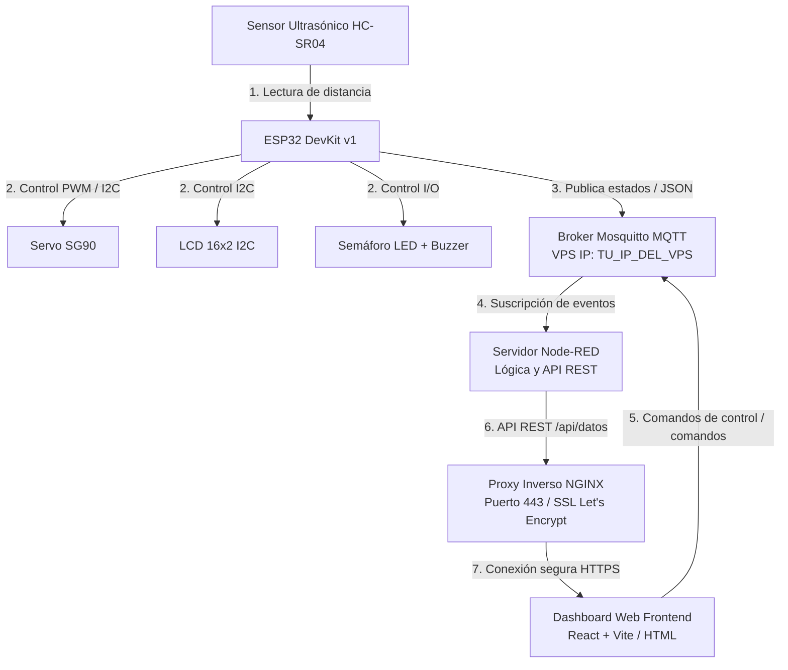

# Diagramas de Arquitectura y Conexionado Físico

Este directorio contiene las especificaciones visuales de la arquitectura de red y el cableado del hardware para el Sistema Inteligente de Control de Acceso Vehicular.

---

## 🌐 1. Arquitectura del Sistema (Flujo de Datos)

El flujo de información y la distribución en 4 capas se esquematiza a continuación:



---

## ⚡ 2. Conexionado Físico y Mapeo de Pines

A continuación se detalla el conexionado de cada uno de los periféricos al microcontrolador ESP32 DevKit v1:

| Componente Físico | Pin Componente | Pin GPIO ESP32 | Tipo de Señal | Descripción |
| :--- | :--- | :--- | :--- | :--- |
| **Sensor HC-SR04** | VCC | Vin (5V) | Alimentación | Suministro eléctrico de 5V |
| **Sensor HC-SR04** | TRIG | GPIO 5 | Salida Digital | Disparo del pulso ultrasónico |
| **Sensor HC-SR04** | ECHO | GPIO 19 | Entrada Digital | Medición del tiempo de retorno |
| **Sensor HC-SR04** | GND | GND | Tierra | Conexión a tierra común |
| **Servomotor SG90** | VCC (Rojo) | Vin (5V) | Alimentación | Suministro eléctrico |
| **Servomotor SG90** | GND (Marrón)| GND | Tierra | Conexión a tierra común |
| **Servomotor SG90** | PWM (Naranja)| GPIO 27 | Salida PWM | Señal de control de ángulo (0° a 90°) |
| **LED Rojo** | Ánodo (+) | GPIO 33 | Salida Digital | Luz roja del semáforo |
| **LED Amarillo** | Ánodo (+) | GPIO 25 | Salida Digital | Luz amarilla del semáforo |
| **LED Verde** | Ánodo (+) | GPIO 26 | Salida Digital | Luz verde del semáforo |
| **Buzzer Pasivo** | Positivo (+) | GPIO 18 | Salida PWM | Alerta acústica de estados |
| **LCD 16x2 I2C** | SDA | GPIO 21 | Bidireccional I2C| Línea de datos de pantalla |
| **LCD 16x2 I2C** | SCL | GPIO 22 | Entrada I2C | Línea de reloj de pantalla |
| **LCD 16x2 I2C** | VCC / GND | Vin / GND | Alimentación | Conexiones eléctricas LCD |

### 🛠️ Esquema del Circuito de Hardware (Representación de Bloques)

```text
       +-----------------------------------------------------------+
       |                       ESP32 DevKit v1                     |
       +-----------------------------------------------------------+
          | Vin   | GND   | GPIO 5 | GPIO 19 | GPIO 27 | GPIO 18 |
          | (5V)  | (Tierra)                                     |
          +---+-------+-------+---------+---------+---------+----+
              |       |       |         |         |         |
     +--------+-------+----+  |         |         |         |
     |   Sensor HC-SR04    |  |         |         |         |
     |   VCC   GND  TRIG  ECHO|  |         |         |
     +----+-----+----+----+   |         |         |
          |     |    |    |   |         |         |
          |     |    +--------+         |         |
          |     |         +-------------+         |         |
          |     |                                 |         |
     +----+-----+----+                            |         |
     |  Servo SG90   |                            |         |
     |  VCC   GND  PWM                            |         |
     +----+-----+----+                            |         |
          |     |   +-----------------------------+         |
          |     |                                           |
          |     |                                 +---------+
          |     |                                 |
          |     |                                 v
          |     |                         +---------------+
          |     |                         | Buzzer Pasivo |
          |     |                         |    +     -    |
          |     |                         +----+-----+----+
          |     |                              |     |
          |     +------------------------------|-----+
          |                                    |
          +------------------------------------+
          
      LEDs (Semáforo):
      ESP32 GPIO 33 ----> [ Resistencia 220Ω ] ----> (LED Rojo)   ----> GND
      ESP32 GPIO 25 ----> [ Resistencia 220Ω ] ----> (LED Amarillo) ----> GND
      ESP32 GPIO 26 ----> [ Resistencia 220Ω ] ----> (LED Verde)  ----> GND

      Pantalla LCD 16x2 I2C:
      ESP32 GPIO 21 (SDA) ----> LCD SDA
      ESP32 GPIO 22 (SCL) ----> LCD SCL
```
